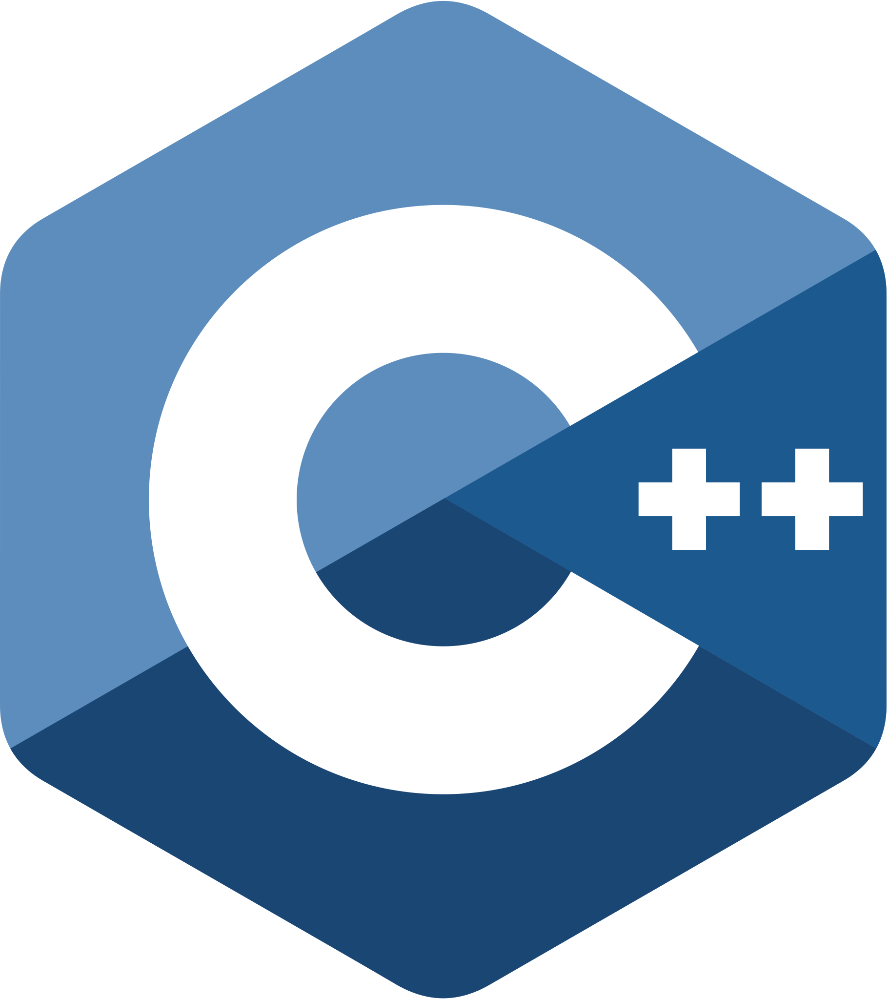
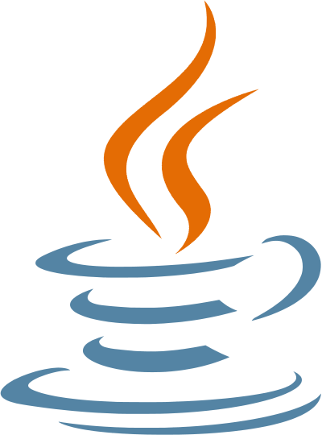

<h1 align="center">Hi, I'm Sriaditya.</h1>

Cryptography · Mathematics · Systems

  

  <a href="https://zyphensvc.com">Portfolio & writing</a> ·
  <a href="https://www.linkedin.com/in/svedantam/">LinkedIn</a> ·
  <a href="mailto:svedantam@zyphensvc.com">Email</a> ·
  <a href="https://zyphensvc.com/media/Zyphen.asc">PGP</a>

I'm **Sriaditya Vedantam**, a cybersecurity and privacy graduate student at the **University of Georgia**, with a background in computer science and mathematics. I study cryptography and build software that puts the theory to work.

- **Exploring** homomorphic encryption, privacy-preserving machine learning, and post-quantum cryptography.
- **Building** automation and API integrations as a Solutions Engineer at **Athens Micro**.
- **Previously** led a 12-person satellite research team and helped organize **ImaginaryCTF**.
- **Around here** you'll find research notes, cryptography experiments, and software projects.

### A few tools I work with

  &nbsp;&nbsp;
  &nbsp;&nbsp;
  &nbsp;&nbsp;
  &nbsp;&nbsp;
  

Python · TypeScript · C/C++ · SQL · SageMath · PyTorch · Linux

Interested in the math behind secure systems? <a href="https://zyphensvc.com">Read my notes ↗</a>
